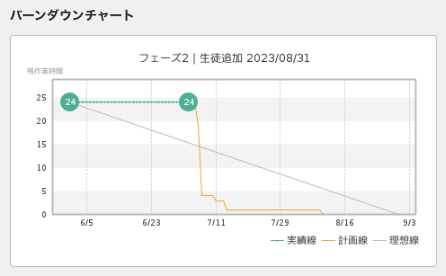

# マイルストーン設定

プロジェクトの進捗を可視化するために、Backlogのチケットにマイルストーンを設定します。  
マイルストーンを設定すると、バーンダウンチャートが利用できます。  
バーンダウンチャートは、作業量の推移や進捗状況をグラフィカルに表示することができます。  

_バーンダウンチャートの見方_

* 実績線: 各チケットのステータスをもとに、未完了の予定工数合計を結んだ線です。
* 計画線: 各チケットの期限日をもとに、予定工数が消化される計画を結んだ線です。
* 理想線: 開始日時点の予定工数を開始地点とし、マイルストーン期限日を残工数0とした終了地点を結んだ直線です。

実績線・計画線が理想線を下回ることが理想ではありますが、最初から完璧を目指すのではなく、まずは理想線から大きく乖離しないようにコントロールすることを目指しましょう。

## マイルストーンの種類と設定

1つのチケットには複数のマイルストーンを設定することが可能です。  
当社では1つのチケットに対して2つのマイルストーンを設定します。

* 開発フェーズ全体のマイルストーン
* 機能単位のマイルストーン

### 開発フェーズ全体のマイルストーン
- 開発フェーズ全体の進捗を把握するために設定します

### 機能単位のマイルストーン
- 機能単位の進捗を明確にするために設定します
- お客様が成果物を確認する際の進捗報告に活用することができます
