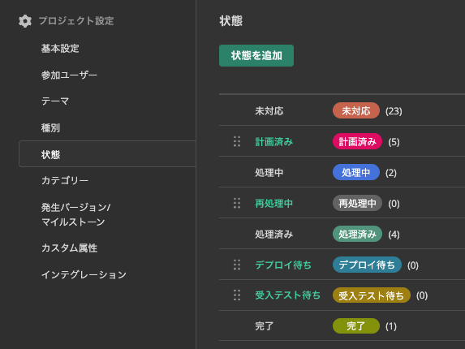

# 開発ワークフローについて

開発を滞りなく進めるため、当社で規定するワークフローについて解説します。

開発フェーズによってワークフロー定義が異なります。
 
* __【ワークフローA】新規開発（結合テストまで）__  
  →機能開発を起点に、機能実装およびレビュー完了までを1つのワークフローとします。
* __【ワークフローB】新規開発（結合テスト以降）または運用保守__  
  →バグ起票を起点に、バグ改修および受入テスト完了までを1つのワークフローとします。

## 【ワークフローA】新規開発（結合テストまで）

アクターが、各状態において実施することをワークフローとして表現しています。
基本はBacklogの課題チケットを用いてコミュニケーションを実施します。
必要に応じてチャットなどを用いて仕様や実装のフォローを実施していきます。

### ワークフロー

| No | 状態     | アクター   | アクション                                         |
|----|----------|------------|--------------------------------------------------|
| 1  | 未対応① | 起票者     | 1. チケット作成  ▼対応後に変更 担当者：開発窓口 |
| 2  | 未対応② | 開発窓口      | 2. 担当者のアサイン  ▼対応後に変更 担当者：開発担当者 |
| 3  | 未対応③ | 開発担当者     | 3. 作業計画  ▼対応後に変更 状態：計画済み |
| 4  | 計画済み | 開発担当者     | ▼実装着手時に変更 状態：処理中 |
| 5  | 処理中   | 開発担当者     | 4. コーディング  ▼対応後に変更 状態：処理済み |
| 6  | 処理済み | 開発担当者     | 5. レビュー対応  ▼対応後に変更 状態：完了 |
| 7  | 完了     |            |                                                      |

#### 状態

Backlogの状態例:  

* 未対応: 起票者によってチケットが作成された状態です。開発担当者が計画立てるまでは未対応として扱います。
* 計画済み: 開発担当者が対応計画を作成し、実装に向けた準備を行っています。
* 処理中: 開発担当者が実装作業や動作確認を行っています。
* 処理済み: 開発担当者が実装を完了し、レビュー対応中の状態です。
* 完了: 実装のレビューおよびマージが完了した状態です。残タスクがある場合、別チケットを起票します。

#### アクター

各担当者は、プロジェクトの進行や品質向上のために協力して作業を行います。

* 起票者: 開発計画に従ってチケットを作成する役割を担当します。
* 開発窓口: チケットの開発担当者割り当てを担当します。起票者と同じ人が行うケースもあります。
* 開発担当者: チケットに対して機能の実装などを担当します。

#### アクション

##### 1. チケット作成

* [仕様／指摘内容の理解](/1.チケット作成/仕様／指摘内容の理解)
* [チケット仕様確認](/1.チケット作成/チケット仕様確認)
    * タイトル／期日設定
    * チケット内容記述
    * 作業スコープ記載
* [マイルストーン設定](/1.チケット作成/マイルストーン設定)

##### 2. 担当者のアサイン

* [アサイン](/1.チケット作成/アサイン)
* [スケジュール設定](/2.チケット仕様確認/スケジュール設定)

##### 3. 作業計画

* [予定工数入力](/2.チケット仕様確認/予定工数入力)
* [ガントチャート確認](/2.チケット仕様確認/ガントチャート確認)
* [設計／修正箇所の検討](/2.チケット仕様確認/設計／修正箇所の検討)

##### 4. コーディング

* [ビルド](/3.実装/ビルド)
* [ブランチ作成](/3.実装/ブランチ作成)
* [コーディング](/3.実装/コーディング)
* [動作確認](/3.実装/動作確認)
* [プルリクエスト作成](/3.実装/プルリクエスト作成)

##### 5. レビュー対応

* [期待値理解](/4.レビュー/期待値理解)
* [変更内容確認](/4.レビュー/変更内容確認)
* [ソースコード確認](/4.レビュー/ソースコード確認)
* [関連箇所のチェック](/4.レビュー/関連箇所のチェック)
* [動作確認](/4.レビュー/動作確認)
* [修正箇所の指摘](/4.レビュー/修正箇所の指摘)
* [マージ](/4.レビュー/マージ)
* [実績工数入力](/4.レビュー/実績工数入力)

## 【ワークフローB】新規開発（結合テスト以降）または運用保守

アクターが、各状態において実施することをワークフローとして表現しています。
基本はBacklogの課題チケットを用いてコミュニケーションを実施します。
必要に応じてチャットなどを用いて仕様や実装のフォローを実施していきます。

### ワークフロー

| No | 状態     | アクター   | アクション                                         |
|----|----------|------------|--------------------------------------------------|
| 1  | 未対応① | 起票者     | 1. チケット作成(バグ登録)  ▼対応後に変更 担当者：開発窓口 |
| 2  | 未対応② | 開発窓口      | 2. 担当者のアサイン  ▼対応後に変更 担当者：開発担当者 |
| 3  | 未対応③ | 開発担当者     | 3. 作業計画  ▼対応後に変更 状態：計画済み |
| 4  | 計画済み | 開発担当者     | ▼実装着手時に変更 状態：処理中 |
| 5  | 処理中   | 開発担当者     | 4. コーディング  ▼対応後に変更 状態：処理済み |
| 6  | 処理済み | 開発担当者     | 5. レビュー対応  ▼対応後に変更 状態：デプロイ待ち 担当者：デプロイ担当者 |
| 7  | デプロイ待ち | デプロイ担当者 | 6. デプロイ  ▼対応後に変更 状態：受入テスト待ち 担当者：起票者 |
| 8  | 受入テスト待ち | 起票者 | 7. 受入テスト  ▼OK時に変更 状態：完了(対応済み)  ▼NG時に変更 状態：再処理中 担当者：開発窓口 |
| 9  | 完了     |            |                                                      |
| 10 | 再処理中①  | 開発窓口 | 2. 担当者のアサイン  ▼対応後に変更 担当者：開発担当者 |
| 11 | 再処理中②  | 開発担当者 | 8. 再処理  ▼対応後に変更 状態：処理中 |

#### 状態

Backlogの状態例:  

* 未対応: 起票者によってチケットが作成された状態です。開発担当者が計画立てるまでは未対応として扱います。
* 計画済み: 開発担当者が対応計画を作成し、実装に向けた準備を行っています。
* 処理中: 開発担当者が実装作業や動作確認を行っています。
* 処理済み: 開発担当者が実装を完了し、レビュー対応中の状態です。
* デプロイ待ち: 開発担当者が実装のレビューが完了し、デプロイ待ち状態です。
* 受入テスト待ち: デプロイ担当者がデプロイを完了し、受け入れテスト中の状態です。
* 完了: テスト担当者が受け入れテストを行い、問題なく完了した状態です。
* 再処理: テスト担当者が受け入れテストで問題が発生し、対応の再処理が必要な状態です。

#### アクター

各担当者は、プロジェクトの進行や品質向上のために協力して作業を行います。

* 起票者: バグや改善要望などの課題を発見し、チケットを作成する役割を担当します。また、デプロイされたシステムの受け入れテストを実施し、合否を判定します。
* 開発窓口: チケットの開発担当者割り当てを担当します。
* 開発担当者: チケットに対してバグ修正や機能の実装などを担当します。
* デプロイ担当者: 実装＆レビューが完了したコードを開発環境、ステージング環境にデプロイします。

#### アクション

##### 1. チケット作成(バグ登録)

* [仕様／指摘内容の理解](/1.チケット作成/仕様／指摘内容の理解)
* [チケット仕様確認](/1.チケット作成/チケット仕様確認)
    * タイトル／期日設定
    * チケット内容記述
    * 作業スコープ記載
* [マイルストーン設定](/1.チケット作成/マイルストーン設定)

##### 2. 担当者のアサイン

* [アサイン](/1.チケット作成/アサイン)
* [スケジュール設定](/2.チケット仕様確認/スケジュール設定)

##### 3. 作業計画

* [予定工数入力](/2.チケット仕様確認/予定工数入力)
* [ガントチャート確認](/2.チケット仕様確認/ガントチャート確認)
* [設計／修正箇所の検討](/2.チケット仕様確認/設計／修正箇所の検討)

##### 4. コーディング

* [ビルド](/3.実装/ビルド)
* [ブランチ作成](/3.実装/ブランチ作成)
* [コーディング](/3.実装/コーディング)
* [動作確認](/3.実装/動作確認)
* [プルリクエスト作成](/3.実装/プルリクエスト作成)

##### 5. レビュー対応

* [期待値理解](/4.レビュー/期待値理解)
* [変更内容確認](/4.レビュー/変更内容確認)
* [ソースコード確認](/4.レビュー/ソースコード確認)
* [関連箇所のチェック](/4.レビュー/関連箇所のチェック)
* [動作確認](/4.レビュー/動作確認)
* [修正箇所の指摘](/4.レビュー/修正箇所の指摘)
* [マージ](/4.レビュー/マージ)
* [実績工数入力](/4.レビュー/実績工数入力)

##### 6. デプロイ

マージ済み最新版をデプロイします。

##### 7. 受入テスト

* [非機能要件確認](/5.テスト/非機能要件確認)
* [テストシート作成](/5.テスト/テストシート作成)
* [バグ共有](/5.テスト/バグ共有)
* [チケット作成](/5.テスト/チケット作成)
* [チケットクローズ](/5.テスト/チケットクローズ)

##### 8. 再処理

受入テストNGの場合、 `3. 作業計画` からやり直します。

以上